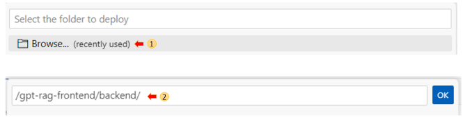

# gpt on your data frontend

Part of [gpt-rag](https://github.com/Azure/gpt-rag)

## Deploy (quickstart)

**Pre-reqs**

- [Azure CLI](https://learn.microsoft.com/en-us/cli/azure/install-azure-cli)
- Node.js 16+ [windows/mac](https://nodejs.dev/en/download/)  [linux/wsl](https://nodejs.dev/en/download/package-manager/)

**1) Provision Services**

Provision the Azure services as explained in [gpt-rag](https://github.com/Azure/gpt-rag) Deploy session, if you haven't done it done already.

**2) Blob storage location**

Update the storage account name in the storage_account variable to point to the account where your data is, tipically it is the account sarting with strag, for example: ```strag```0m4dgz.

file: ```frontend/src/api/api.ts```

Example: storage account ```strag0m4dgz```
```
var storage_account = "strag0m4dgz";
```

**3) Build App**

Everytime you change frontend code you need to build it before a new deployment, including in the first time:

```
cd frontend
npm install
npm run build
```

**4) Deploy to Azure** 

In VSCode with [Azure Web App Extension](https://marketplace.visualstudio.com/items?itemName=ms-azuretools.vscode-azureappservice) go to the *Azure* Window, reveal your Web App in the resource explorer, right-click it then select *Deploy to Web App*. 

Once Deploy to Web App is selected, it will ask for which folder to deploy **backend** is the folder that we should select for the deploy.



## **(Optional) Test locally** 

1) rename ```.env.template``` to ```.env``` updating the variables accordingly.

2) run ```azd auth login``` or ```az login```

3) run ```./start.sh```

## Frontend customizations

Optionally you can customize some itens in the frontend.

**1) Title**

Update page's title

file: ```frontend/src/pages/layout/Layout.tsx```

```
<h4 className={styles.headerRightText}>Chat On Your Data/h4>
```

file: ```frontend/src/pages/layout/index.html```

```
<title>Chat Chat On Your Data | Demo</title>
```

**2) Logo**

Update frontend logo

file: ```frontend/src/pages/layout/Layout.tsx```

Example:
```
<Link to="/" className={styles.headerTitleContainer}>
    </img>
    <h3 className={styles.headerTitle}></h3>
</Link>
```

**3) Citations**

You can remove citations from the answers if you do not want them. Just set showSources to {false}

file: ```frontend/src/pages/chat/Chat.tsx```

```
<Answer
    key={index}
    answer={answer[1]}
    isSelected={selectedAnswer === index && activeAnalysisPanelTab !== undefined}
    onCitationClicked={c => onShowCitation(c, index)}
    onThoughtProcessClicked={() => onToggleTab(AnalysisPanelTabs.ThoughtProcessTab, index)}
    onSupportingContentClicked={() => onToggleTab(AnalysisPanelTabs.SupportingContentTab, index)}
    onFollowupQuestionClicked={q => makeApiRequest(q)}
    showFollowupQuestions={false}
    showSources={false}                                            
/>
```

**4) Speech Synthesis**

To enable speech synthesis change speechSynthesisEnabled variable to true.

file: ```frontend/src/pages/chat/Chat.tsx```

```
const speechSynthesisEnabled = true;
```

## Contributing

This project welcomes contributions and suggestions.  Most contributions require you to agree to a
Contributor License Agreement (CLA) declaring that you have the right to, and actually do, grant us
the rights to use your contribution. For details, visit https://cla.opensource.microsoft.com.

When you submit a pull request, a CLA bot will automatically determine whether you need to provide
a CLA and decorate the PR appropriately (e.g., status check, comment). Simply follow the instructions
provided by the bot. You will only need to do this once across all repos using our CLA.

This project has adopted the [Microsoft Open Source Code of Conduct](https://opensource.microsoft.com/codeofconduct/).
For more information see the [Code of Conduct FAQ](https://opensource.microsoft.com/codeofconduct/faq/) or
contact [opencode@microsoft.com](mailto:opencode@microsoft.com) with any additional questions or comments.

## Trademarks

This project may contain trademarks or logos for projects, products, or services. Authorized use of Microsoft
trademarks or logos is subject to and must follow
[Microsoft's Trademark & Brand Guidelines](https://www.microsoft.com/en-us/legal/intellectualproperty/trademarks/usage/general).
Use of Microsoft trademarks or logos in modified versions of this project must not cause confusion or imply Microsoft sponsorship.
Any use of third-party trademarks or logos are subject to those third-party's policies.
